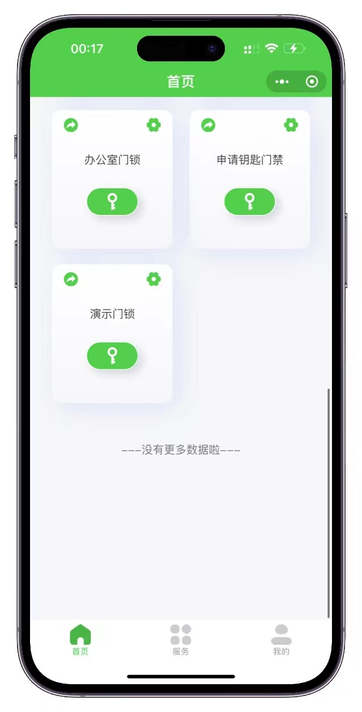

# 微门禁小程序项目

## 下载请给个Star

**Star是攻城狮生发的动力！**

## 关于项目

由于比较忙，无法频繁更新开源库。如需最新功能，请联系我们获取最新版本。

## 项目演示

## 项目介绍

**微门禁小程序项目**，免费开源。

因有很多同学不会编译，`pre_wxminiapp_20240831` 中提供了已编译好的版本，省去编译步骤。只需替换名称、AppID，并搜索代码中的域名 `wxapp.wmj.com.cn` 替换成自己的域名，然后提交发布即可。

体验二维码无法放，请搜索“微门禁小程序”进入体验。

## 代码说明

### 目录结构

- **wxapp.wmj.com.cn**: 管理后台源码
- **wxapp_miniprogram**: 早期版本微信小程序源码（不再新增功能）
- **wxapp_new_vue**: 微信小程序端Vue，uniapp源码，用HbuiderX编译发布
- **pre_wxminiapp_20240831**: 编译好的版本，可以直接用微信开发者工具预览上传发布的。记得搜索并修改小程序AppID、小程序名称、连接后台的域名。

## 管理后台安装教程

对于新手，强烈建议使用宝塔面板。

1. 基于ThinkPHP6.0开发，用Nginx，站点伪静态设置为ThinkPHP。
2. PHP 7.4
3. MySQL 5.6.5
4. 修改数据库连接：在根目录下 `.env` 文件，数据库脚本为 `miniprogram.sql`
5. 后台超级管理员：`admin`，默认密码：`wmj123456`
6. 运行目录为 `public`

## 使用说明

详情见：[微门禁小程序使用说明](https://doc.wmj.com.cn/1/page/34)

### 关键配置

#### 1. 管理平台配置文件

站点搭建好后的后台系统管理 -> 系统配置 -> 接口配置，按里面的要求配置硬件的 AppID 等。

路径：`/config/my.php`  
配置小程序 AppID 和 AppSecret。

#### 2. 微信小程序后台的合法域名配置

路径：开发 -> 开发设置 -> 服务器域名 -> 业务域名等。  
根据自己的域名进行配置。

#### 3. 微信小程序后台普通二维码调起小程序规则配置

路径：开发 -> 开发设置 -> 扫普通链接二维码打开小程序

##### 扫码开门的配置

- **二维码规则填写**: `域名/minilock?user_id=`
- **小程序功能页面填写**: `pages/open/open`

##### 注册的配置

- **二维码规则填写**: `域名/adduser`
- **小程序功能页面填写**: `pages/adduser/adduser`

## 小程序代码使用说明

### 修改说明

1. 修改域名：位于 `app.js` 文件
   
2. 修改小程序 AppID：位于 `project.config.json` 文件
   
3. 修改图片 Logo 等：根据需要在图片中进行修改。

## 将微信号绑定为超级管理员

### 步骤

小程序能正常登录和绑定手机号后，进入会员管理，找到要绑定为超级管理员的会员编号。在系统管理 -> 用户管理 -> 修改信息，填入会员编号即可。

