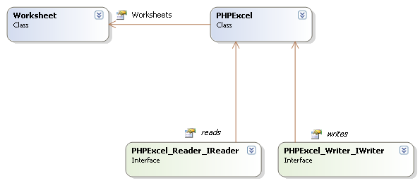

# Architecture

## Schematical



## AutoLoader

PhpSpreadsheet relies on Composer autoloader. So before working with
PhpSpreadsheet in standalone, be sure to run `composer install`. Or add it to a
pre-existing project with `composer require phpoffice/phpspreadsheet`.

## Spreadsheet in memory

PhpSpreadsheet's architecture is built in a way that it can serve as an
in-memory spreadsheet. This means that, if one would want to create a
web based view of a spreadsheet which communicates with PhpSpreadsheet's
object model, he would only have to write the front-end code.

Just like desktop spreadsheet software, PhpSpreadsheet represents a
spreadsheet containing one or more worksheets, which contain cells with
data, formulas, images, ...

## Readers and writers

On its own, the `Spreadsheet` class does not provide the functionality
to read from or write to a persisted spreadsheet (on disk or in a
database). To provide that functionality, readers and writers can be
used.

By default, the PhpSpreadsheet package provides some readers and
writers, including one for the Open XML spreadsheet format (a.k.a. Excel
2007 file format). You are not limited to the default readers and
writers, as you are free to implement the
`\PhpOffice\PhpSpreadsheet\Reader\IReader` and
`\PhpOffice\PhpSpreadsheet\Writer\IWriter` interface in a custom class.


## Fluent interfaces

PhpSpreadsheet supports fluent interfaces in most locations. This means
that you can easily "chain" calls to specific methods without requiring
a new PHP statement. For example, take the following code:

``` php
$spreadsheet->getProperties()->setCreator("Maarten Balliauw");
$spreadsheet->getProperties()->setLastModifiedBy("Maarten Balliauw");
$spreadsheet->getProperties()->setTitle("Office 2007 XLSX Test Document");
$spreadsheet->getProperties()->setSubject("Office 2007 XLSX Test Document");
$spreadsheet->getProperties()->setDescription("Test document for Office 2007 XLSX, generated using PHP classes.");
$spreadsheet->getProperties()->setKeywords("office 2007 openxml php");
$spreadsheet->getProperties()->setCategory("Test result file");
```

This can be rewritten as:

``` php
$spreadsheet->getProperties()
    ->setCreator("Maarten Balliauw")
    ->setLastModifiedBy("Maarten Balliauw")
    ->setTitle("Office 2007 XLSX Test Document")
    ->setSubject("Office 2007 XLSX Test Document")
    ->setDescription("Test document for Office 2007 XLSX, generated using PHP classes.")
    ->setKeywords("office 2007 openxml php")
    ->setCategory("Test result file");
```

> **Using fluent interfaces is not required** Fluent interfaces have
> been implemented to provide a convenient programming API. Use of them
> is not required, but can make your code easier to read and maintain.
> It can also improve performance, as you are reducing the overall
> number of calls to PhpSpreadsheet methods: in the above example, the
> `getProperties()` method is being called only once rather than 7 times
> in the non-fluent version.
